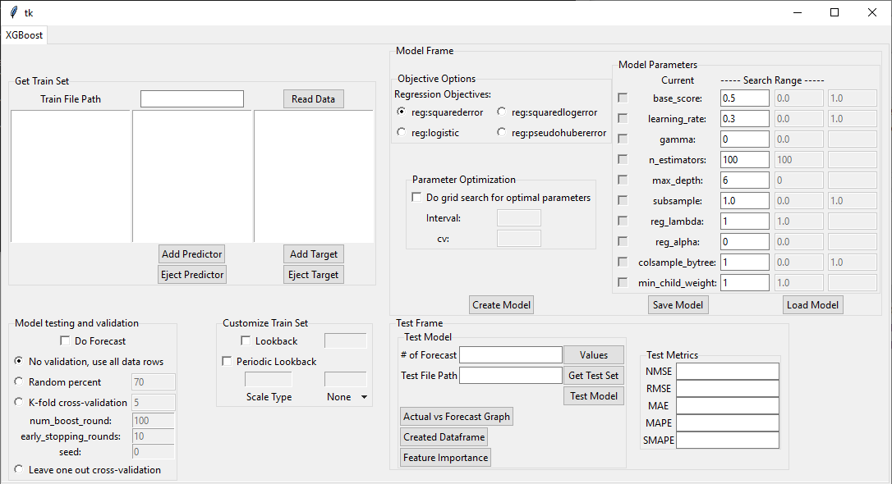

# machine-learning-gui
This project includes creating, saving and loading a model processes with all hyperparameters needed. And some features as feature importance table, features after feature extraction operations especially for the lags of time series datas etc. 

